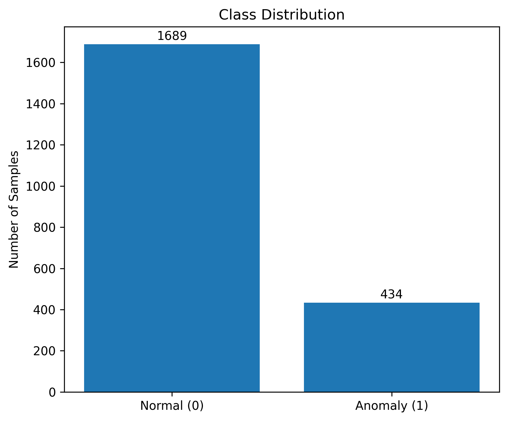
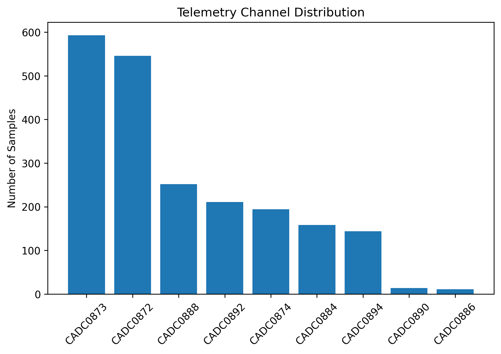

# Satellite Telemetry Anomaly Detection using Machine Learning

An end-to-end machine learning project for detecting anomalies in satellite telemetry data using the **ESA OPS-SAT** dataset. This project implements a complete ML pipeline, including data preprocessing, feature engineering, model training, evaluation, and visualization to identify anomalous telemetry patterns.

---

## 📌 Project Overview

Satellite telemetry provides continuous measurements of spacecraft health and operational status. Detecting anomalous telemetry is essential for identifying system faults early, improving mission reliability, and enabling predictive maintenance.

This project develops a supervised machine learning pipeline to classify telemetry samples as **Normal** or **Anomalous** using statistical telemetry features extracted from the ESA OPS-SAT dataset.

---

## 📂 Dataset

- **Dataset:** ESA OPS-SAT Telemetry Dataset
- **Total Samples:** 2,123
- **Original Features:** 20
- **Final Features Used:** 15
- **Target Variable:** `anomaly`
- **Classes:**
  - Normal (0)
  - Anomaly (1)

### Preprocessing Steps

- Removed unnecessary columns (`segment`, `train`)
- Encoded categorical telemetry channel
- Performed correlation analysis
- Removed highly correlated features
- Split dataset into training and testing sets (80:20)
- Applied feature scaling for Support Vector Machine

---

## 🔄 Machine Learning Workflow

```
ESA OPS-SAT Dataset
        │
        ▼
 Dataset Inspection
        │
        ▼
Exploratory Data Analysis
        │
        ▼
 Data Preprocessing
 • Remove unnecessary columns
 • Encode categorical feature
        │
        ▼
 Feature Engineering
 • Correlation Analysis
 • Remove redundant features
        │
        ▼
 Train-Test Split (80:20)
        │
        ▼
 Feature Scaling (SVM)
        │
        ▼
 Model Training
 ├── Random Forest
 ├── XGBoost
 └── Support Vector Machine
        │
        ▼
 Model Evaluation
 • Accuracy
 • Precision
 • Recall
 • F1-Score
 • ROC-AUC
 • Confusion Matrix
        │
        ▼
 Performance Comparison
        │
        ▼
 Final Model Selection
```

---

## 🤖 Machine Learning Models

The following supervised learning algorithms were implemented and compared:

- Random Forest
- XGBoost
- Support Vector Machine (SVM)

---

## 📊 Model Performance

| Model | Accuracy | Precision | Recall | F1-Score | ROC-AUC |
|--------|---------:|----------:|--------:|---------:|---------:|
| Random Forest | **94.59%** | **94.44%** | 78.16% | **85.53%** | 97.73% |
| XGBoost | 94.12% | 90.79% | 79.31% | 84.66% | 97.81% |
| Support Vector Machine | 93.41% | 82.42% | **86.21%** | 84.27% | **98.28%** |

### Key Observations

- **Random Forest** achieved the highest Accuracy, Precision, and F1-Score, making it the best overall performing model.
- **Support Vector Machine** obtained the highest Recall and ROC-AUC, making it highly effective at detecting anomalies.
- **XGBoost** demonstrated competitive performance across all evaluation metrics.

---

## 📈 Visualizations

### Class Distribution



---

### Telemetry Channel Distribution



---

### Correlation Heatmap


---

### Random Forest Feature Importance


---

### XGBoost Feature Importance


---

### ROC Curve Comparison


---

### Confusion Matrix Comparison


---

### Model Performance Comparison


---

## 📁 Repository Structure

```
ESA-OPS-SAT-Anomaly-Detection
│
├── data/
│   └── dataset.csv
│
├── images/
│   ├── class_distribution.png
│   ├── channel_distribution.png
│   ├── correlation_heatmap.png
│   ├── feature_importance_rf.png
│   ├── feature_importance_xgb.png
│   ├── roc_curve.png
│   ├── confusion_matrix.png
│   └── performance_comparison.png
│
├── models/
│   ├── random_forest.pkl
│   ├── svm.pkl
│   └── xgboost.pkl
│
├── notebooks/
│   └── Satellite_Telemetry_Anomaly_Prediction.ipynb
│
├── requirements.txt
├── LICENSE
└── README.md
```

---

## 🛠️ Technologies Used

- Python
- Pandas
- NumPy
- Matplotlib
- Scikit-learn
- XGBoost
- Joblib
- Google Colab

---

## 🚀 Installation

Clone the repository:

```bash
git clone https://github.com/AtharvaPDevOps/ESA-OPS-SAT-Anomaly-Detection.git
```

Install the required dependencies:

```bash
pip install -r requirements.txt
```

Run the notebook inside the `notebooks` directory using Jupyter Notebook or Google Colab.

---

## 📌 Results

Among the three evaluated machine learning models, **Random Forest** achieved the best overall performance by balancing classification accuracy, precision, and F1-score while maintaining an excellent ROC-AUC score. The trained models have also been included in this repository for reproducibility.

---

## 🔮 Future Improvements

- Deep Learning based anomaly detection
- Real-time telemetry monitoring
- Autoencoder-based anomaly detection
- LSTM models for temporal telemetry analysis
- Explainable AI (SHAP/LIME) for model interpretation

---

## 📄 License

This project is licensed under the MIT License.
